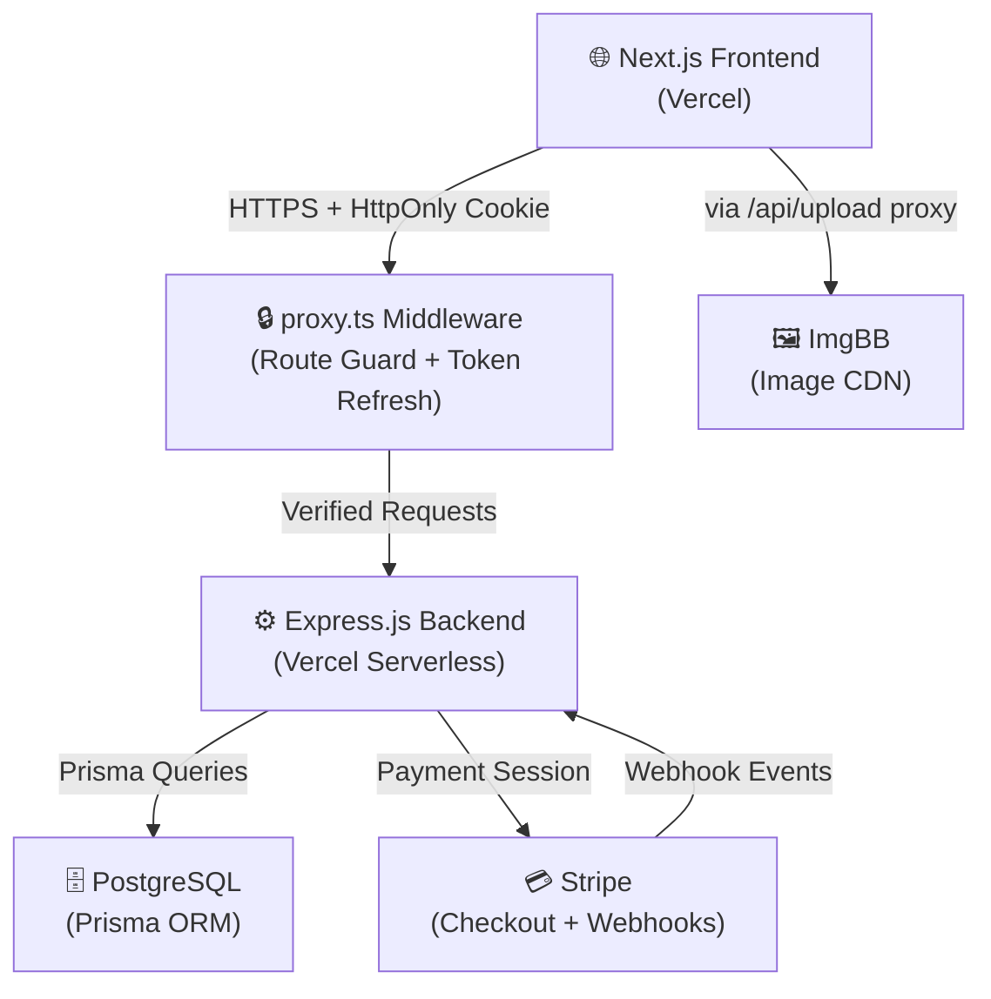

<div align="center">

# ⚡ GearUp

### Your premium destination for renting top-quality sports & outdoor equipment

[](https://gear-up-green.vercel.app/)
[](https://gearupshop.vercel.app)

---

[](https://nextjs.org/)
[](https://expressjs.com/)
[](https://www.typescriptlang.org/)
[](https://www.postgresql.org/)
[](https://www.prisma.io/)
[](https://stripe.com/)
[](https://tailwindcss.com/)
[](https://vercel.com/)
[](https://opensource.org/licenses/MIT)

</div>

---

## 📋 Table of Contents

- [Overview](#-overview)
- [Live Demo](#-live-demo)
- [Key Features](#-key-features)
- [Tech Stack](#-tech-stack)
- [System Architecture](#-system-architecture)
- [Database Schema](#-database-schema)
- [API Documentation](#-api-documentation)
- [Getting Started](#-getting-started)
- [Environment Variables](#-environment-variables)
- [Project Structure](#-project-structure)
- [Screenshots](#-screenshots)
- [Contributing](#-contributing)
- [License](#-license)
- [Acknowledgements](#-acknowledgements)

---

## 🌟 Overview

**GearUp** is a full-stack, multi-role web application that connects outdoor adventure enthusiasts with equipment providers. Whether you need a trek bike for the weekend, a camera lens for a shoot, or a camping tent for a trail adventure — GearUp makes it effortless to rent premium gear from verified providers across the platform.

Built with **Next.js 16 App Router** on the frontend and **Express.js v5** with **PostgreSQL + Prisma** on the backend, GearUp delivers a seamless rental experience with real-time payment processing via **Stripe**, role-based dashboards for customers, providers, and admins, and a fully automated rental lifecycle from browsing to return.

The platform is production-deployed on **Vercel** with server-side rendering, secure JWT authentication via HttpOnly cookies, automated token refresh middleware, and a complete provider-to-customer rental workflow — making it a truly enterprise-grade platform.

---

## 🚀 Live Demo

| | Link |
|---|---|
| 🌐 **Frontend** | [https://gear-up-green.vercel.app/](https://gear-up-green.vercel.app/) |
| ⚙️ **Backend API** | [https://gearupshop.vercel.app](https://gearupshop.vercel.app) |
| 🐙 **Frontend Repo** | [github.com/diganta-dev/Gear-Up-](https://github.com/diganta-dev/Gear-Up-) |
| 🐙 **Backend Repo** | [github.com/diganta-dev/B7A4](https://github.com/diganta-dev/B7A4) |

---

## ✨ Key Features

### 👤 For Customers
- 🔐 **Secure Registration & Login** — Role-based JWT authentication with HttpOnly cookie sessions
- 🔍 **Browse & Discover Gear** — Filter by category, brand, price range, and real-time availability
- 📅 **Flexible Date Booking** — Interactive date picker with smart conflict detection
- 💳 **Stripe-Powered Checkout** — Secure payment processing with instant webhook confirmation
- 📦 **Order Tracking** — Real-time rental order status tracking (`PLACED → CONFIRMED → PICKED_UP → RETURNED`)
- ⭐ **Review System** — Leave ratings and feedback after a successfully completed rental
- 👤 **Profile Management** — Update name, profile photo (ImgBB powered), and password

### 🏪 For Providers
- 📝 **Gear Listing Management** — Add, edit, and remove equipment with rich specifications
- 📊 **Inventory Dashboard** — Monitor all listed gear, stock levels, and availability status
- 📬 **Order Management** — View incoming customer orders and update fulfillment status
- 🖼️ **ImgBB Image Uploads** — Direct gear image uploads without managing external hosting

### 👑 For Admins
- 🛡️ **User Management** — View, suspend, or reactivate any platform user
- 🔄 **Role Management** — Promote users between `CUSTOMER`, `PROVIDER`, and `ADMIN` roles
- 📋 **Platform Oversight** — Monitor all gear listings and rental orders across the entire platform
- 📊 **Platform Stats** — View real-time totals for orders, gear listings, and rentals

---

## 🛠️ Tech Stack

### Frontend

| Technology | Version | Purpose |
|---|---|---|
| **Next.js** | 16.2.12 | React framework with App Router & SSR |
| **React** | 19.2.4 | UI library |
| **TypeScript** | 5.x | Type safety |
| **Tailwind CSS** | v4 | Utility-first styling |
| **shadcn/ui** | Latest | Headless component system |
| **React Hook Form** | v7 | Form state management |
| **Zod** | v4 | Schema validation |
| **Sonner** | Latest | Toast notifications |
| **Lucide React** | Latest | Icon library |
| **next-themes** | Latest | Dark / Light mode |
| **jsonwebtoken** | Latest | JWT client decode |

### Backend

| Technology | Version | Purpose |
|---|---|---|
| **Node.js** | v18+ | JavaScript runtime |
| **Express.js** | v5 | HTTP framework |
| **TypeScript** | 7.x | Type safety |
| **PostgreSQL** | Latest | Relational database |
| **Prisma** | v7 | ORM & database client |
| **jsonwebtoken** | Latest | JWT auth token creation |
| **bcryptjs** | Latest | Password hashing |
| **Stripe** | v22 | Payment processing |
| **Zod** | Latest | Request validation |
| **cors** | Latest | CORS policy management |
| **tsup** | Latest | ESM build tool |

---

## 🏗️ System Architecture



**Request Flow:**
1. Browser sends request with `accessToken` HttpOnly cookie
2. Next.js `proxy.ts` middleware intercepts — validates token, role, and refreshes if expired
3. Approved requests proxied to Express.js backend
4. Express controllers query PostgreSQL via Prisma ORM
5. Payment flows through Stripe Checkout → Stripe sends webhook to backend → order confirmed

---

## 🗄️ Database Schema

| Model | Key Fields | Relations |
|---|---|---|
| `User` | `id`, `name`, `email`, `role` (CUSTOMER/PROVIDER/ADMIN), `status`, `profileImage` | GearItems, RentalOrders, Reviews |
| `Category` | `id`, `name`, `description`, `image` | GearItems |
| `GearItem` | `id`, `name`, `brand`, `dailyRentalPrice`, `stock`, `availability`, `images[]` | Provider (User), Category, RentalOrderItems, Reviews |
| `RentalOrder` | `id`, `startDate`, `endDate`, `totalAmount`, `status`, `customerId` | Customer (User), RentalOrderItems, Payment |
| `RentalOrderItem` | `id`, `quantity`, `pricePerDay` | RentalOrder, GearItem |
| `Payment` | `id`, `amount`, `status`, `stripeSessionId`, `stripePaymentIntentId` | RentalOrder |
| `Review` | `id`, `rating`, `comment` | Customer (User), GearItem |

---

## 📡 API Documentation

### 🔐 Authentication — `/api/auth`

| Method | Endpoint | Description | Access |
|---|---|---|---|
| `POST` | `/api/auth/register` | Register new user (CUSTOMER or PROVIDER) | Public |
| `POST` | `/api/auth/login` | Login and receive JWT cookie | Public |
| `GET` | `/api/auth/me` | Get current authenticated user profile | Private |
| `POST` | `/api/auth/logout` | Clear auth cookies and end session | Private |
| `POST` | `/api/auth/change-password` | Update account password | Private |
| `POST` | `/api/auth/refresh-token` | Refresh expired access token | Private |

### 🏕️ Gear & Categories

| Method | Endpoint | Description | Access |
|---|---|---|---|
| `GET` | `/api/gear` | Browse gear (search, filter, paginate) | Public |
| `GET` | `/api/gear/:id` | Get gear detail page with reviews | Public |
| `GET` | `/api/categories` | Get all equipment categories | Public |

### 📦 Rentals — `/api/rentals`

| Method | Endpoint | Description | Access |
|---|---|---|---|
| `POST` | `/api/rentals` | Place a new rental order | Customer |
| `GET` | `/api/rentals` | Get current user's rental history | Customer |
| `GET` | `/api/rentals/:id` | Get specific order details | Customer |

### 💳 Payments — `/api/payments`

| Method | Endpoint | Description | Access |
|---|---|---|---|
| `POST` | `/api/payments/create` | Create Stripe checkout session | Customer |
| `POST` | `/api/payments/confirm` | Stripe webhook for payment confirmation | Webhook |
| `GET` | `/api/payments` | Get user's payment history | Customer |

### 🏪 Provider — `/api/provider`

| Method | Endpoint | Description | Access |
|---|---|---|---|
| `GET` | `/api/provider/gear` | List provider's inventory | Provider |
| `POST` | `/api/provider/gear` | Add new gear listing | Provider |
| `PATCH` | `/api/provider/gear/:id` | Update a gear listing | Provider |
| `DELETE` | `/api/provider/gear/:id` | Remove a gear listing | Provider |
| `GET` | `/api/provider/orders` | View orders for provider's gear | Provider |
| `PATCH` | `/api/provider/orders/:id` | Update rental order status | Provider |

### 👑 Admin — `/api/admin`

| Method | Endpoint | Description | Access |
|---|---|---|---|
| `GET` | `/api/admin/users` | View all registered users | Admin |
| `PATCH` | `/api/admin/users/:id` | Update user status or role | Admin |
| `GET` | `/api/admin/gear` | View all platform gear | Admin |
| `GET` | `/api/admin/rentals` | View all platform rental orders | Admin |
| `DELETE` | `/api/admin/gear/:id` | Delete or archive a gear listing | Admin |

> **Note:** All `/api/provider/*` and `/api/admin/*` routes are protected by role-based middleware that validates JWT claims server-side. Unauthorized access returns `403 Forbidden`.

---

## 🚀 Getting Started

### Prerequisites

- Node.js `v18+`
- PostgreSQL (local or cloud instance)
- Stripe account (for payments)
- ImgBB account (for image uploads)
- Git

---

### ⚙️ Backend Setup

```bash
# 1. Clone the backend repository
git clone https://github.com/diganta-dev/B7A4.git
cd B7A4

# 2. Install dependencies
npm install

# 3. Create .env file (see Environment Variables section below)
cp .env.example .env

# 4. Push Prisma schema to your database
npx prisma db push

# 5. Generate Prisma client
npx prisma generate

# 6. (Optional) Seed the database with sample data
npm run seed

# 7. Start the development server
npm run dev
# Backend runs on http://localhost:5000
```

---

### 🌐 Frontend Setup

```bash
# 1. Clone the frontend repository
git clone https://github.com/diganta-dev/Gear-Up-.git
cd Gear-Up-

# 2. Install dependencies
npm install

# 3. Create your .env file (see Environment Variables below)
cp .env.example .env

# 4. Add your ImgBB API key (get it free at https://api.imgbb.com/)
echo "IMGBB_API_KEY=your_key_here" >> .env

# 5. Start the development server
npm run dev
# Frontend runs on http://localhost:3000
```

---

## 🔐 Environment Variables

### Backend `.env`

```env
PORT=5000
APP_URL=http://localhost:3000

# PostgreSQL connection string
DATABASE_URL="postgresql://<USER>:<PASSWORD>@localhost:5432/<DB_NAME>?schema=public"

# JWT Secrets
JWT_SECRET="your_secure_jwt_secret_here"
JWT_EXPIRES_IN="7d"
JWT_REFRESH_SECRET="your_secure_refresh_secret_here"
JWT_REFRESH_EXPIRES_IN="30d"

# Stripe
STRIPE_SECRET_KEY="sk_test_..."
STRIPE_WEBHOOK_SECRET="whsec_..."
```

### Frontend `.env`

```env
# Backend API Base URL
BACKEND_API_URL=https://gearupshop.vercel.app

# JWT Secrets (must match backend)
JWT_SECRET=your_super_secure_access_secret_key
JWT_EXPIRATION=7d
JWT_REFRESH_SECRET=your_super_secure_refresh_secret_key
JWT_REFRESH_EXPIRATION=30d

# ImgBB Image Hosting — Get free key at https://api.imgbb.com/
IMGBB_API_KEY=your_imgbb_api_key_here
```

> **Note — Stripe Webhooks:** To test Stripe webhooks locally, use the [Stripe CLI](https://stripe.com/docs/stripe-cli):
> ```bash
> stripe listen --forward-to localhost:5000/api/payments/confirm
> ```
> Use the printed webhook secret as your `STRIPE_WEBHOOK_SECRET` in `.env`.

---

## 📁 Project Structure

### Frontend (`Gear-Up-/`)

```
Gear-Up-/
├── app/                        # Next.js App Router
│   ├── (auth)/                 # Login & Register pages
│   ├── (dashboard)/            # Protected dashboard routes
│   │   ├── profile/            # User profile & AI recommendations
│   │   ├── dashboard/          # Customer dashboard & orders
│   │   ├── admin-dashboard/    # Admin panel
│   │   └── provider-dashboard/ # Provider inventory & orders
│   ├── gear/                   # Public gear browsing & detail pages
│   ├── api/                    # Next.js API Routes (ImgBB proxy, etc.)
│   ├── layout.tsx              # Root layout with providers
│   └── error.tsx               # Global error boundary
├── components/
│   ├── ui/                     # shadcn/ui base components
│   └── shered/                 # Shared feature components
├── lib/
│   └── utils.ts                # cn(), getValidImageUrl(), etc.
├── service/                    # API service layer (fetch calls)
│   ├── getme.ts                # Fetch current user
│   ├── gear.ts                 # Gear listing queries
│   ├── rentals.ts              # Rental order management
│   ├── admin.ts                # Admin mutations
│   ├── profile.ts              # Profile update server actions
│   └── provider-gear.ts        # Provider gear mutations
├── types/                      # TypeScript interfaces
│   ├── gear.ts
│   ├── rental.ts
│   └── user.ts
├── utils/
│   └── jwt.ts                  # JWT verify helper
├── proxy.ts                    # Next.js middleware (auth guard + token refresh)
├── next.config.ts
├── tailwind.config.ts
└── package.json
```

### Backend (`B7A4/`)

```
B7A4/
├── src/
│   ├── server.ts               # Entry point
│   ├── app.ts                  # Express app, middleware, routes
│   ├── routes/                 # Route definitions per module
│   ├── controllers/            # Request handlers
│   ├── middlewares/            # Auth, role guard, error handler
│   ├── services/               # Business logic layer
│   └── utils/                  # Shared utilities
├── prisma/
│   ├── schema.prisma           # Prisma data model
│   └── migrations/             # Database migrations
├── generated/prisma/           # Generated Prisma client
├── prisma.config.ts
├── tsup.config.ts
├── vercel.json
└── package.json
```

---

## 📸 Screenshots

> *Screenshots coming soon — see the [Live Demo](https://gear-up-green.vercel.app/) to experience the full UI.*

| Page | Description |
|---|---|
| **Homepage** | Hero section, featured gear grid, "How It Works" |
| **Browse Gear** | Filter sidebar, gear cards with availability indicators |
| **Gear Detail** | Full spec page, date picker, booking flow |
| **Customer Dashboard** | Order history, status tracking, review prompts |
| **Provider Dashboard** | Inventory table, gear CRUD, incoming order management |
| **Admin Dashboard** | User management, gear moderation, rental oversight |
| **Profile Page** | ImgBB photo upload, AI gear recommendations, stats |

---

## 🤝 Contributing

Contributions are welcome! Please follow these steps:

1. **Fork** the repository on GitHub
2. **Create** a feature branch
   ```bash
   git checkout -b feature/your-feature-name
   ```
3. **Commit** your changes with a clear message
   ```bash
   git commit -m "feat: add gear availability calendar"
   ```
4. **Push** to your fork
   ```bash
   git push origin feature/your-feature-name
   ```
5. **Open a Pull Request** against the `main` branch with a detailed description

Please make sure your code:
- Passes `npx tsc --noEmit` with zero errors
- Follows existing naming and file structure conventions
- Includes relevant UI feedback (toasts, inline errors) for any new API calls

---

## 📄 License

This project is licensed under the **MIT License** — see the [LICENSE](LICENSE) file for details.

```
MIT License

Copyright (c) 2026 Diganta Sikder

Permission is hereby granted, free of charge, to any person obtaining a copy
of this software and associated documentation files (the "Software"), to deal
in the Software without restriction, including without limitation the rights
to use, copy, modify, merge, publish, distribute, sublicense, and/or sell
copies of the Software, and to permit persons to whom the Software is
furnished to do so, subject to the following conditions:
...
```

---

## 🙏 Acknowledgements

- [**Programming Hero Level 2**](https://www.programming-hero.com/) — Project assignment & mentorship
- [**Next.js**](https://nextjs.org/) — The most powerful React framework
- [**Prisma**](https://www.prisma.io/) — Effortless database access with TypeScript
- [**Stripe**](https://stripe.com/) — World-class payment infrastructure
- [**shadcn/ui**](https://ui.shadcn.com/) — Beautiful, accessible component system
- [**ImgBB**](https://api.imgbb.com/) — Free image hosting API
- [**Vercel**](https://vercel.com/) — Seamless serverless deployment

---

<div align="center">

Made with ❤️ by [**diganta-dev**](https://github.com/diganta-dev)

⭐ **Star this repo** if you found it useful!
** Thank you so much for everything PH Team .

</div>
